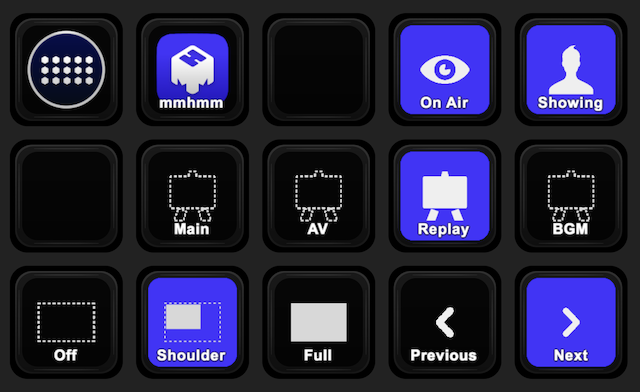

# Stream Deck Plugin for mmhmm.app

This is a Stream Deck plugin to control [mmhmm.app](https://www.mmhmm.app/) with node.js and JXA (JavaScript for Automation).

## Requirements

- MacOS Mojave (10.14) or later  
  It may work on MacOS Yosemite (10.10) or later which supports JXA, although I tested on MacOS Mojave (10.14) only.
- [mmhmm.app](https://www.mmhmm.app/) v1.4.2  
  It may work with newer versions, although I tested with [v1.4.2](https://updates.mmhmm.app/mac/releases/mmhmm-1.4.2.pkg) only.
- [node](https://nodejs.org)
- [cliclick](https://github.com/BlueM/cliclick) v5.0 or later  
  It's needed to switch scenes.

## Features

- Toggle "Away"
- Toggle Presenter's Opacity
- Select Scene (.mmhmm profile)
- Select Slides Display mode (Slides off / Shoulder / Full)
- Go to the next/previous slide

## References

- https://nodejs.org
- https://github.com/JXA-Cookbook/JXA-Cookbook
- https://github.com/websockets/ws
- https://github.com/winstonjs/winston
- https://github.com/mikaelbr/node-osascript
- https://www.timsblog.nl/2021/01/04/writing-plugins-for-the-elgato-stream-deck/
- https://github.com/winstonjs/logform/blob/master/splat.js
- https://github.com/nodejs/node/blob/b1c8f15c5f169e021f7c46eb7b219de95fe97603/lib/util.js#L201-L230
